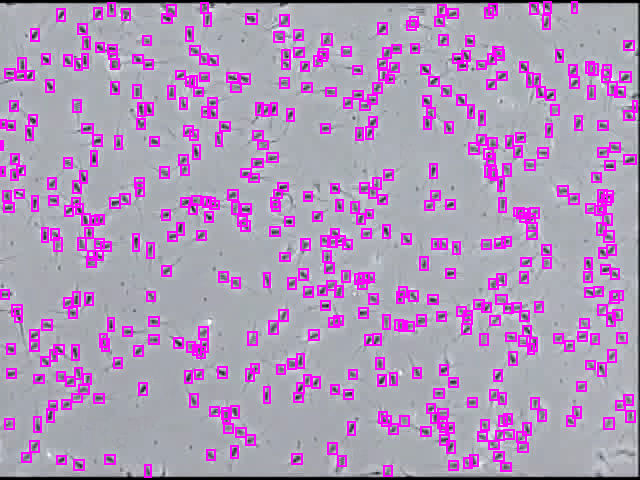
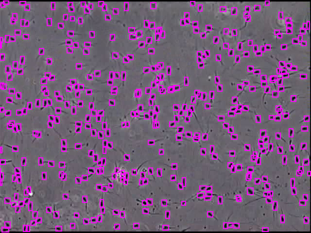

# DeepSperm

**To test on validation and test image**
> `./darknet detector test ./data/spermRand.data ./cfg/deepSperm640-RAJA-APC-DOawalCut2Rand2.cfg ./backup/deepSperm640-RAJA-APC-DOawalCut2Rand2_1200.weights ./data/sperm/motilitas_90_-2azriORIGINAL49.jpg  -gpu 0 -thresh 0.05`

> `./darknet detector test ./data/spermRand.data ./cfg/deepSperm640-RAJA-APC-DOawalCut2Rand2.cfg ./backup/deepSperm640-RAJA-APC-DOawalCut2Rand2_1200.weights ./data/sperm2/40_45test.png  -gpu 0 -thresh 0.05`

**To test on video**
**Please wait until the browser finished loading so that the GIF files visualize their maximum fps**
As an additional information, the GIF files are limited to 25fps. They are for illustration purposes only. The real result achieves 50.3 fps (2x faster than the GIF). 

> `./darknet detector demo ./data/spermRand.data ./cfg/deepSperm640-RAJA-APC-DOawalCut2Rand2.cfg ./backup/deepSperm640-RAJA-APC-DOawalCut2Rand2_1200.weights ./data/sperm/motilitas_90_-2_1OpenCV.avi -out_filename resultMot90-deepSperm.avi -gpu 0 -thresh 0.05`

**To test on video (Server, AWS, Google colaboratory: use -dont_show)**
> `./darknet detector demo ./data/spermRand.data ./cfg/deepSperm640-RAJA-APC-DOawalCut2Rand2.cfg ./backup/deepSperm640-RAJA-APC-DOawalCut2Rand2_1200.weights ./data/sperm2/40-45_-3ICAICTA_OPENCV.avi -dont_show -out_filename result40_45-deepSperm.avi -gpu 0 -thresh 0.05`
After it's done, open the result file.

